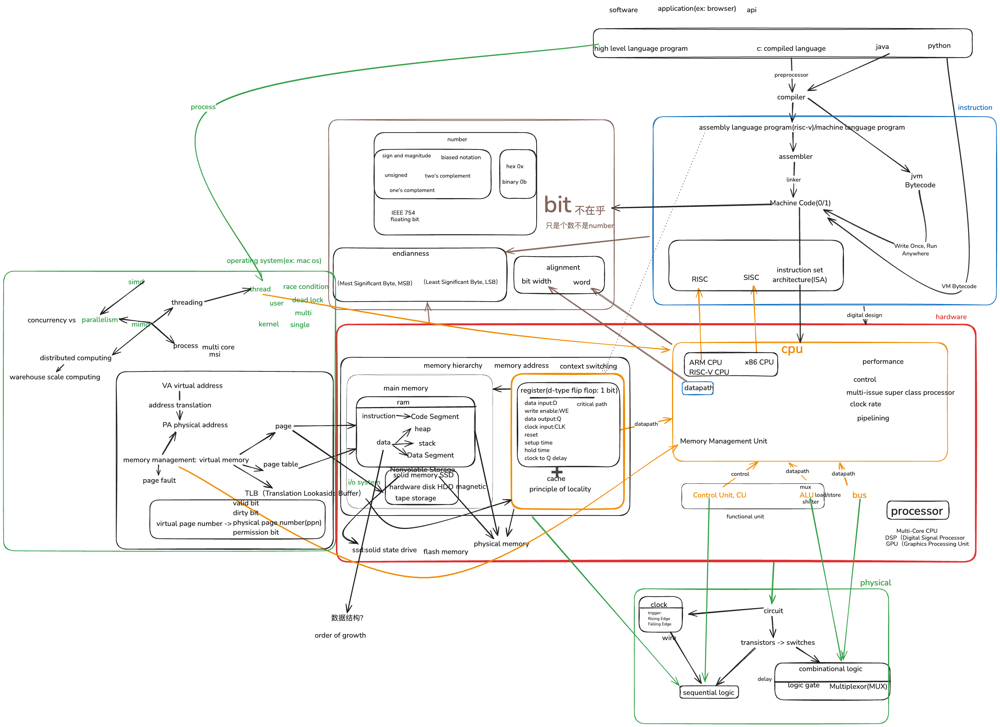
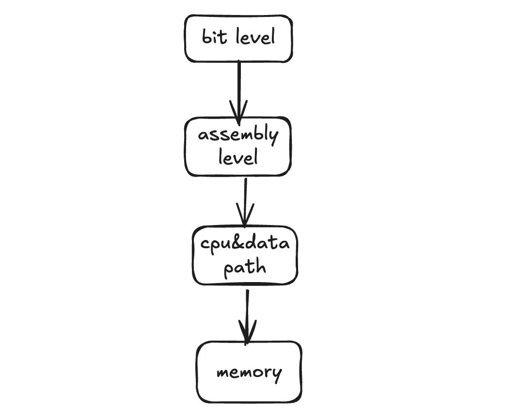

---

title: "Principles of Computer Composition"  
weight: 0  
date: 2025-03-12  
type: "posts"  

---

## Whole Picture

Hi! This is my Computer Architecture notebook, created while studying UC Berkeley’s CS61C online course. It's truly an amazing course! After reviewing all the lecture notes, I tried to connect all the concepts together to grasp the full picture of how a computer system works.

Below is a mind map illustrating my understanding of the overall structure of a computer system and some aspects of Operating Systems:



---

## Suggested Learning Path

This blog is structured intentionally according to the following learning path. I believe it is essential to first understand bits, as they form the fundamental building blocks. Then, comprehending the Instruction Set Architecture (ISA) becomes important for understanding how hardware communicates. Once we grasp ISA, we can explore the CPU and data paths. Finally, memory concepts and cache mechanisms help bridge our understanding towards Operating System operations.



| Step   | Topics                   | Reasoning                                    |
|--------|--------------------------|----------------------------------------------|
| Step 1 | Bits & Floating Points   | Build foundational understanding of binary data and representation |
| Step 2 | ISA & Registers          | Understand how software instructions communicate with hardware components |
| Step 3 | CPU & Datapath           | Deepen our knowledge of the core computing pipeline |
| Step 4 | Pipeline, Memory & Cache | Learn about performance optimization techniques and system efficiency |

---

## Ultimate Comparison: Computer Organization vs. Operating Systems

While studying CS61C, I often found the distinction between computer organization and operating systems confusing. Here is my attempt at clarifying these two distinct yet closely related fields:

### Computer Organization vs. Operating Systems

| Category                 | Computer Organization (Hardware)                                 | Operating System (OS)                                       |
|--------------------------|------------------------------------------------------------------|-------------------------------------------------------------|
| Research Goal            | Structural design at the hardware level, such as CPU, registers, and memory interactions | Resource management at the software level, such as CPU scheduling, memory allocation, and process management |
| Hierarchical Position    | Closer to hardware, emphasizing logic circuits and data pathways | Closer to user applications, acting as an intermediary      |
| Components               | ALU, Control Unit, Cache, ISA, Data Path                         | Process management, Virtual memory, File system, System calls |
| Key Techniques           | Binary arithmetic, Instruction formats, Register files, Pipelining | Multithreading, Memory paging, Inter-process communication  |
| Common Misunderstandings | Also covers memory hierarchies but focuses on structural design principles | Also addresses memory (e.g., virtual memory, paging) but focuses on policy and management decisions |
| Analogy                  | Structural engineers building a physical structure               | Management companies operating and managing the structure   |

---

## An Illustrative Example

Consider executing the following line of code:

```c
int a = b + c;
```

### Concerns from the Computer Organization Perspective:

- How does this instruction get translated into machine code?
- How is data stored and accessed in registers?
- How does the ALU execute this addition operation?
- How does data flow inside the CPU to execute this operation?

### Concerns from the Operating System Perspective:

- Which process is responsible for executing this instruction?
- How should the OS schedule CPU resources to execute it?
- On which page in virtual memory does variable `a` reside?
- Does this code execution require disk access?

---

## Why Are These Concepts Easily Confused?

Concepts such as virtual memory, page tables, and address translation mechanisms are commonly addressed in both Operating Systems and Computer Organization, albeit from different perspectives:

- **Computer Organization Perspective:**  
  Focuses on the physical and structural implementation of address translation mechanisms, such as TLBs and caches.

- **Operating System Perspective:**  
  Emphasizes using these mechanisms for policy management and resource allocation decisions, like paging strategies, process isolation, and handling page faults.

---

## Additional Reference: CS61C Slides

The diagrams included in these notes are from UC Berkeley's CS61C (Spring 2022). A special thanks to the course instructors and teaching staff for the excellent materials. This blog is strictly for educational and non-commercial use.


