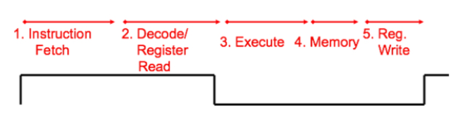

## Clock Cycle

A **single-cycle CPU** completes **all stages** of an instruction within **one long clock cycle**.

Each instruction goes through the following five stages:
> All stages of an instruction completed **within one long clock cycle**

- Clock cycle sufficiently long to allow each instruction to complete **all stages without interruption**

```
1. Instruction Fetch 
→ 2. Decode/Register Read 
→ 3. Execute 
→ 4. Memory 
→ 5. Reg. Write
```

1. **Instruction Fetch**
2. **Decode / Register Read**
3. **Execute**
4. **Memory Access**
5. **Register Write Back**

> The clock cycle is long enough to complete all these stages without interruption.

---

## Instruction Execution Stages (RISC-V)

| Stage | Name                        | Description |
|-------|-----------------------------|-------------|
| IF    | **Instruction Fetch**       | Fetch the instruction from `IMEM`, increment `PC += 4` |
| ID    | **Instruction Decode**      | Decode the instruction, read `rs1` and `rs2` |
| EX    | **Execute**                 | Perform computation via ALU (arithmetic or address calculation) |
| MEM   | **Memory Access**           | `lw`: read from memory; `sw`: write to memory |
| WB    | **Write Back**              | Write result to `rd` |

> Every instruction passes through **IF, ID, EX, WB**.  
> Only `lw` and `sw` instructions go through the **MEM** stage.


## processor:

### Design Principles

5 Steps to Design a Processor:

1. Analyze instruction set → datapath requirements  
2. Select set of datapath components & establish clock methodology  
3. Assemble datapath meeting the requirements  
4. Analyze implementation of each instruction to determine setting of control points that affect register transfer  
5. Assemble the control logic
   - Formulate Logic Equations  
   - Design Circuits  

Control logic determines how the CPU executes each instruction

### Determining control signals

- Any time a datapath element has an input that changes behavior, it requires a **control signal**
  - e.g., ALU operation, read/write signal  
- Use a **MUX** when multiple sources decide the same destination  
- Different instructions → different control signals
- Your control signals will **change based on your datapath**
- Your datapath will **change based on your ISA**


### The "Iron Law" of Processor Performance

```
Time / Program = 
    (Instructions / Program) × 
    (Cycles / Instruction) × 
    (Time / Cycle)
```

This formula breaks down **execution time** into three key components:

---

#### 1. Instructions / Program

- How many instructions are executed in a program?
- Affected by: compiler, algorithm, and **ISA design**

##### Examples:
- CISC (Complex Instruction Set Computer)
  - Fewer instructions needed to do more work
- RISC (Reduced Instruction Set Computer)
  - Simpler instructions, but more of them may be needed

---

#### 2. CPI (Cycles / Instruction)

- How many clock cycles does each instruction take?
- Affected by: instruction type, pipeline structure, data hazards

##### Examples:
- RISC-V aims for **CPI ≈ 1** (1 instruction per cycle)
- Complex instructions (e.g., `DIV`) may take multiple cycles

---

#### 3. Time / Cycle

- How long is each clock cycle?
- Affected by: technology node, clock frequency, and fabrication

##### Examples:
- Time per cycle = `1 / frequency`
- 2GHz → 0.5 nanoseconds per cycle

---

### Energy per Program

```
Energy / Program = 
    (Instructions / Program) × 
    (Energy / Instruction)
```

Alternative form:

```
Energy / Program ∝ 
    (Instructions / Program) × 
    C × V²
```

Where:
- `C` = capacitance, depends on design and number of cores  
- `V` = supply voltage

---

### Energy “Iron Law”

```
Performance = Power × Energy Efficiency

             = (Joules / Second) × (Tasks / Joule)
             = Tasks / Second
```

---

### Key Implications

- **Energy efficiency** (e.g., instructions per Joule) is a critical metric
- For **power-constrained systems** (e.g., data centers):
  - Need higher energy efficiency to deliver more performance per watt
- For **energy-constrained systems** (e.g., phones):
  - Need better energy efficiency to extend battery life

