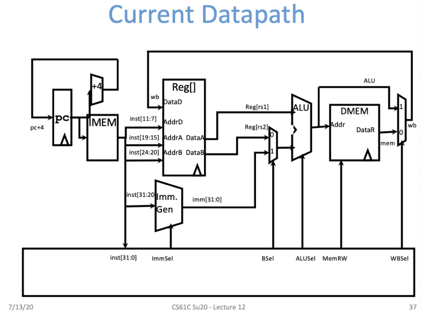
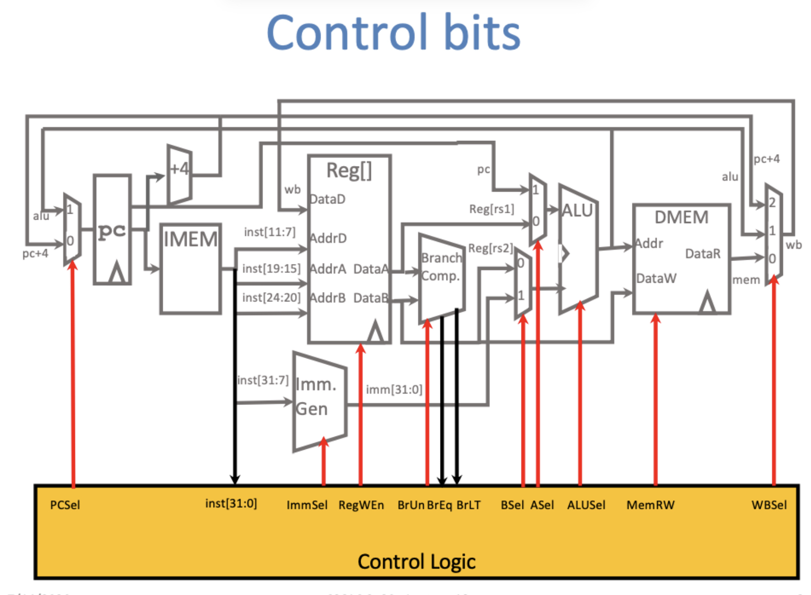
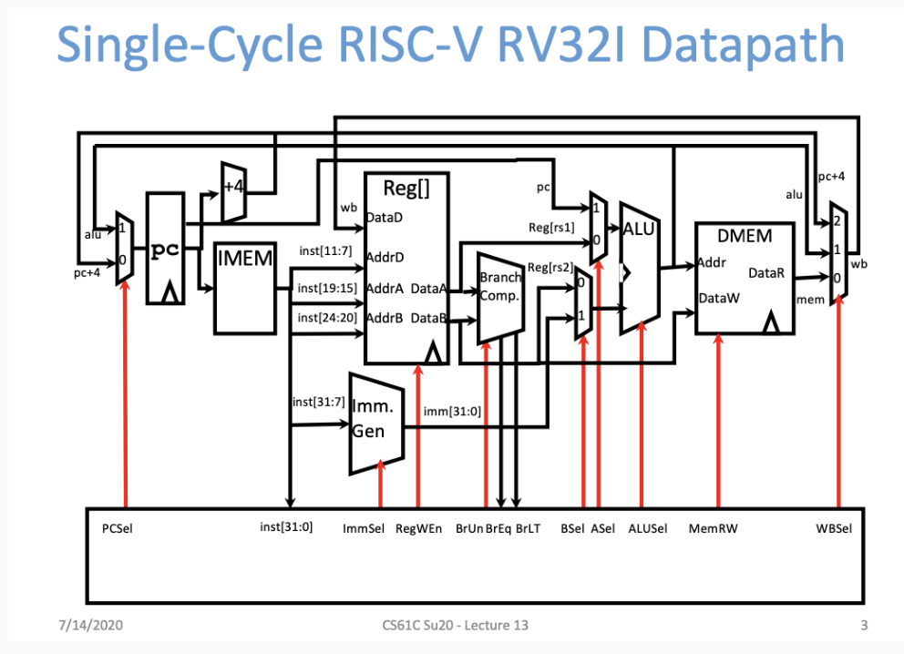

# 1. Current Datapath



**Graph:**  
*(Insert current datapath diagram here)*

---

# 2. Component Table

| Abbreviation | Full Name              | Function                                                           |
|--------------|------------------------|--------------------------------------------------------------------|
| IMEM         | Instruction Memory     | Stores instruction codes, used for fetch                          |
| Reg[]        | Register File          | Register file containing 32 registers (x0 ~ x31)                  |
| Imm.Gen      | Immediate Generator    | Extracts immediate from instruction                               |
| inst         | Instruction            | Current instruction fetched from IMEM                             |
| rs1          | Register Source 1      | First input operand from Reg[]                                    |
| rs2          | Register Source 2      | Second input operand from Reg[]                                   |
| DMEM         | Data Memory            | Used in lw/sw instructions                                        |
| ImmSel       | Immediate Select       | Selects immediate type (I, S, B, U, J)                             |
| BSel         | B Operand Select       | Selects between rs2 or imm as second operand                      |
| ALUSel       | ALU Operation Select   | ALU operation selector (add, sub, logic, etc.)                    |
| MemRW        | Memory Read/Write      | Controls memory read/write (`lw` or `sw`)                         |
| DataR        | Data Read              | Data read from DMEM                                               |
| Addr         | Address                | Address sent to DMEM                                              |
| Mem          | Memory                 | Memory module                                                     |
| WB           | Write Back             | Controls whether to write back ALU or memory result to Reg[]      |

---

# 3. IMEM vs DMEM

| Storage | Function             | Content                              |
|---------|----------------------|--------------------------------------|
| IMEM    | Instruction Memory   | Instruction codes                    |
| DMEM    | Data Memory          | Data accessed by lw/sw               |

---

# 4. rs1 vs rs2 vs rd

| Field | Meaning               | Example (`add x1, x2, x3`) |
|-------|------------------------|-----------------------------|
| rs1   | First source operand   | x2                          |
| rs2   | Second source operand  | x3                          |
| rd    | Destination register   | x1                          |

---

# 5. Immediate Generator (Imm.Gen)

| Instruction Example          | Extracted Immediate |
|-----------------------------|---------------------|
| `addi x1, x2, 10`            | 10                  |
| `sw x1, 100(x2)`             | 100                 |
| `beq x1, x2, -8`             | -8                  |

---

# 6. ALUSel & BSel

| Signal   | Function                     | Options                              |
|----------|------------------------------|--------------------------------------|
| ALUSel   | Selects ALU operation        | add, sub, AND, OR, XOR, shift        |
| BSel     | Selects second operand       | rs2 or imm                           |

---

# 7. MemRW (Memory Read/Write)

| Signal | Meaning      |
|--------|--------------|
| 0      | Read (`lw`)  |
| 1      | Write (`sw`) |

---

# 8. WB (Write Back)

| Signal | Meaning                         |
|--------|----------------------------------|
| 0      | Write back ALU result           |
| 1      | Write back memory data from DMEM|

---

# 9. Single-Cycle RISC-V RV32I Datapath

*(Insert single-cycle datapath diagram here)*

---

# 10. Control Unit (Control Signals)

**Control Bits Diagram:**  
*(Insert control lines marked on datapath)*

**Control Bits Explanation:**

- PCSel: Does this instruction change the PC? What's the next PC?
- ImmSel: Does this instruction use an immediate? What type?
- RegWEn: Does it write to `rd`?
- BrUn: Is the branch signed or unsigned?
- BSel: Does ALU use rs2 or imm?
- ASel: Does ALU use rs1 or PC?
- ALUSel: What operation does ALU perform?
- MemRW: Should we read/write from memory?
- WBSel: What result to write back to rd?

---

# 11. Key Control Signal Table

| Control Signal | Function                              | Example Instructions             |
|----------------|----------------------------------------|----------------------------------|
| PCSel          | Select next PC (sequential or branch)  | JAL, BEQ, BNE                    |
| ImmSel         | Select immediate type (I, S, B, U, J)  | ADDI, LW, SW                     |
| RegWEn         | Write back to `rd` register or not     | ADD, ADDI, LW                    |
| BrUn           | Unsigned branch flag                   | BLTU, BGEU                       |
| BSel           | Select 2nd ALU operand (rs2 or imm)    | ADDI (imm), ADD (rs2)            |
| ASel           | Select 1st ALU operand (rs1 or PC)     | AUIPC (uses PC)                  |
| ALUSel         | ALU operation (add, sub, shift, etc.)  | ADD, SUB, AND, OR                |
| MemRW          | Access data memory (read = 0, write = 1)| LW (read), SW (write)           |
| WBSel          | Select data to write back              | ADD → ALU, LW → Memory           |

---

# 12. Multicycle Stages

| Stage | Meaning                | Function Description                           |
|-------|------------------------|-------------------------------------------------|
| IF    | Instruction Fetch      | Fetch instruction from IMEM, PC += 4           |
| ID    | Instruction Decode     | Decode and read rs1/rs2                        |
| EX    | Execute                | ALU calculates (arithmetic or address)         |
| MEM   | Memory Access          | LW read / SW write                             |
| WB    | Write Back             | Write result to rd                             |

---

# 13. Instruction Example (`lw x1, 0(x2)`)

| Cycle | Stage | Action            | Description                                      |
|-------|-------|--------------------|--------------------------------------------------|
| 1     | IF    | Fetch instruction  | Load instruction into IR                        |
| 2     | ID    | Decode x2          | Read value of x2, prepare ALU input             |
| 3     | EX    | Calc x2 + offset   | ALU adds x2 + 0                                 |
| 4     | MEM   | Memory access      | Read data from DMEM at address                  |
| 5     | WB    | Write x1           | Store memory data to x1                         |

---

# 14. Control Signal Timing Table

| Cycle | Signals                                      | Meaning                                     |
|-------|----------------------------------------------|---------------------------------------------|
| IF    | PCWrite=1, IRWrite=1, ALUSrcA=0              | PC+4, fetch next instr                      |
|       | ALUSrcB=01, ALUOp=00, IorD=0                 |                                             |
| ID    | ALUSrcA=0, ALUSrcB=11, ALUOp=00              | Calc x2 + offset                            |
| EX    | ALUSrcA=1, ALUSrcB=10, ALUOp=00              | Execute address calc                        |
| MEM   | MemRead=1, IorD=1                            | Read from DMEM                              |
| WB    | RegWrite=1, MemtoReg=1                       | Write value to rd                           |

---

# 15. FSM (Simplified State Diagram)

```
State 0: IF
 → Next: State 1

State 1: ID
 → Next: State 2

State 2: EX (address calculation)
 → Next: State 3

State 3: MEM (memory read)
 → Next: State 4

State 4: WB (write back)
 → Next: State 0
```

---

# 16. Key Datapath Components per Stage (Multicycle)

| Stage | Modules Used                                    |
|-------|-------------------------------------------------|
| IF    | PC, IMEM, ALU (PC+4), MUX (ALUSrcB)             |
| ID    | RegFile, Imm.Gen, ALU (offset prep)             |
| EX    | ALU (x2+offset), MUX (ALUSrcA/B)                |
| MEM   | Memory (DMEM)                                   |
| WB    | RegFile, MUX (MemtoReg)                         |

---

# 17. Multicycle Execution Summary

1. `lw = load word`, load data from memory  
2. Split into 5 cycles (IF, ID, EX, MEM, WB)  
3. One action per cycle  
4. Control signals generated per cycle by FSM  
5. Hardware reused across cycles (e.g., ALU for both PC+4 and address calc)  
6. Saves hardware, increases control complexity  

---

# 18. Single-Cycle vs. Multicycle CPU Comparison

| Dimension              | Single-Cycle CPU                       | Multicycle CPU                         |
|------------------------|----------------------------------------|----------------------------------------|
| Instruction Duration   | One cycle per instruction              | 4~6 cycles per instruction             |
| Control Type           | Combinational logic                    | Finite State Machine (FSM)             |
| Datapath Usage         | Modules used once per instruction      | Modules reused across cycles           |
| Signal Control         | Decided once per instruction           | Decided separately each cycle          |
| Instruction Flow       | Fetch → Decode → Execute → Write Back | Step-by-step execution                 |
| Clock Period           | Longest instruction determines cycle   | Shorter cycles by splitting stages     |
| Resource Efficiency    | Low (idle after use)                   | High (reuse modules per cycle)         |
| Teaching Suitability   | Simpler, good for intro                | Closer to real CPU implementation      |

---

# 19. Execution Flow: Single-Cycle

```
PC fetch instruction  
Decode instruction  
Reg[x2] + 0  
Access memory  
Write to x1

One cycle must complete all
Cycle must match longest instruction
```

---

# 20. Execution Flow: Multicycle (Incremental)

```
Cycle 1: IF    → Fetch instruction from PC
Cycle 2: ID    → Decode, read x2
Cycle 3: EX    → ALU computes address = x2 + 0
Cycle 4: MEM   → Read memory
Cycle 5: WB    → Write to x1
```

```
[Fetch] → [Decode] → [Address Calc] → [Memory Access] → [Write Back]
