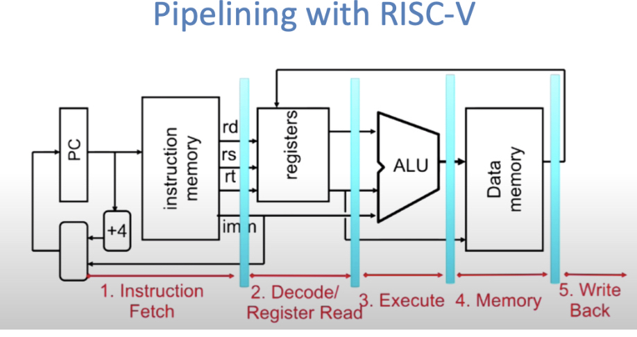
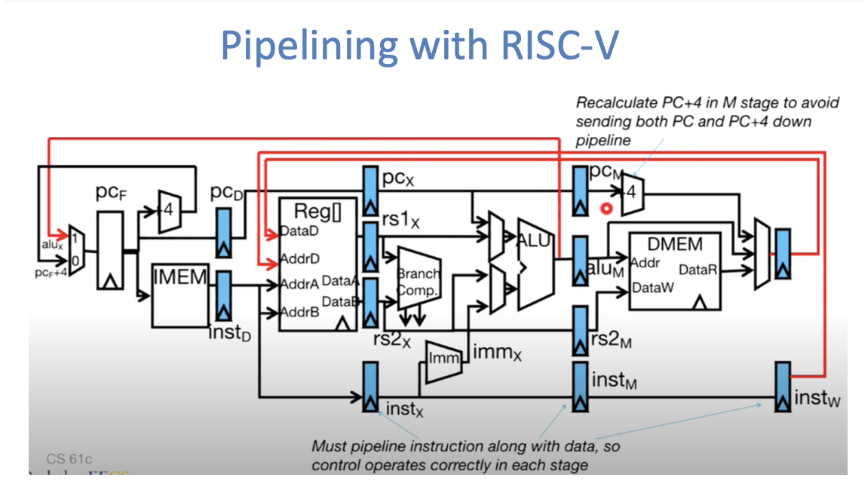

## What is a pipeline?

Pipelining refers to processing different parts of multiple instructions simultaneously to improve CPU **throughput**.

## Five-stage pipeline structure (RISC-V)

- IF ➝ ID ➝ EX ➝ MEM ➝ WB



**Graph:**  
*From cs61c*
This diagram shows the five classic stages in a RISC-V pipelined processor:
1. **Instruction Fetch (IF)** – Fetch instruction from memory.
2. **Instruction Decode / Register Read (ID)** – Decode the instruction and read source registers.
3. **Execute / Address Calculation (EX)** – Perform ALU operations or calculate addresses.
4. **Memory Access (MEM)** – Read/write data from/to memory.
5. **Write Back (WB)** – Write result back to register file.


---

## Multicycle → Pipelining

### Five Classic Pipeline Stages in RISC-V

| Stage | Name                              | Description                               |
|-------|-----------------------------------|-------------------------------------------|
| IF    | Instruction Fetch                 | Fetch instruction from memory             |
| ID    | Instruction Decode / Register Read | Decode instruction and read registers     |
| EX    | Execute / Address Calculation     | Perform ALU operations or address compute |
| MEM   | Memory Access                     | Access memory (read/write)                |
| WB    | Write Back                        | Write result back to registers            |

---

### How do multiple instructions run in parallel?

Each instruction enters the pipeline and advances one stage per cycle.

| Cycle   | IF | ID | EX | MEM | WB |
|---------|----|----|----|-----|----|
| Cycle 1 | A  |    |    |     |    |
| Cycle 2 | B  | A  |    |     |    |
| Cycle 3 | C  | B  | A  |     |    |
| Cycle 4 | D  | C  | B  | A   |    |
| Cycle 5 | E  | D  | C  | B   | A  |

---

## Pipeline Registers

| Register | Role                                                                 |
|----------|----------------------------------------------------------------------|
| IF/ID    | Stores the instruction address and content from the IF stage         |
| ID/EX    | Stores decoded register values, immediate values, control signals    |
| EX/MEM   | Stores ALU results, target addresses, data to be written             |
| MEM/WB   | Stores memory output or ALU result, ready to be written back         |


## Data Hazard

A **data hazard** occurs when an instruction depends on the result of a previous instruction that hasn’t completed its write-back yet.

#### Solutions:

- **Forwarding**: Fetch the result early from the EX/MEM or MEM/WB pipeline stage
- **Stall**: Pause the instruction for one or two cycles until the data is ready

---

#### Comparison of Solutions:

| Method     | Mechanism                                     | Example                         | Cycles | Notes                        |
|------------|-----------------------------------------------|----------------------------------|--------|------------------------------|
| Stall      | Pause the pipeline until data is ready        | `add x1, x2, x3`<br>`sub x4, x1, x5` | +1 ~ 2 | Simple but slows performance |
| Forwarding | Forward results from EX/MEM or MEM/WB stage   | Same as above                   | 0      | High performance, no stall   |

---

#### Example:

```asm
add x1, x2, x3   // result written to x1
sub x4, x1, x5   // needs x1 → Data hazard!
```

- With **Stall**: sub must wait until `add` finishes WB stage
- With **Forwarding**: sub can grab x1 early from EX/MEM → No stall!

---

### Timeline when Forwarding works

```asm
Cycle | add x1,x2,x3 | sub x4,x1,x5 | nop |
------|--------------|--------------|-----|
C1    | IF           |              |     |
C2    | ID           | IF           |     |
C3    | EX           | ID           |     |
C4    | MEM          | EX [Forward] |     |
C5    | WB           | MEM          |     |
C6    |              | WB           |     |
```

> At **Cycle 4**:
> - `add` is in MEM stage, x1 result stored in EX/MEM
> - `sub` is in EX stage, needs x1
> - Forwarding module detects it, grabs x1 from EX/MEM

---

### What if there's no Forwarding?

```asm
Cycle | add x1,x2,x3 | nop | sub x4,x1,x5 |
------|--------------|-----|--------------|
C1    | IF           |     |              |
C2    | ID           | IF  |              |
C3    | EX           | ID  |              |
C4    | MEM          | NOP | IF           |
C5    | WB           |     | ID           |
C6    |              |     | EX           |
```

> You’ll have to insert a `nop` to stall the `sub` instruction!

### Control Hazard

A **control hazard** occurs when a branch or jump instruction (e.g., `beq`) is encountered, and the next instruction to execute is uncertain.

#### Solutions:

- **Branch prediction**: Predict the next instruction path
- **Insert NOP (bubble)**: Stall until the branch decision is known

---

### What is a Control Hazard?

When we encounter **conditional branch instructions** (e.g., `beq`, `bne`, `jalr`):

We don’t know **which instruction** to execute next — it depends on whether the branch is taken.

The condition is only known in the **EX** stage,  
But we’ve already fetched the next instruction in the **IF** stage.

→ This may lead to executing the wrong path.

---

### The Most Conservative Fix: Insert a Bubble

#### Example:

```asm
beq x1, x2, label   // branch instruction
add x3, x4, x5      // possibly wrong instruction
```

If the `beq` is taken, the `add` is incorrect and must be flushed.

So we insert a **NOP (bubble)** to wait for the result of `beq`.

```text
Cycle | beq       | add
------|-----------|-----------
C1    | IF        |
C2    | ID        | IF
C3    | EX        | ID (wait)
C4    | MEM       | EX
C5    | WB        | MEM
```

---

### Is Bubble Too Conservative? Use Branch Prediction

---

### What is Branch Prediction?

Before knowing whether to take the branch, the CPU **guesses**:

- **Predict taken** → fetch the target instruction
- **Predict not taken** → continue sequentially

If the guess is correct, pipelining continues  
If the guess is wrong, the pipeline is flushed and restarted

---

### Static Branch Prediction (Simplest)

| Rule             | Meaning                     |
|------------------|------------------------------|
| Predict Not Taken | Assume all branches are not taken |
| Predict Taken     | Assume all branches are taken     |

- Advantage: Simple logic  
- Disadvantage: Easy to mispredict

---

### Dynamic Branch Prediction

Let the CPU learn from past branch behavior and make smarter predictions.

#### 1-bit Predictor

Each branch instruction maintains a 1-bit flag:

- `0` means "not taken last time", so predict not taken
- `1` means "taken last time", so predict taken

| Actual Outcome     | New Predictor State |
|--------------------|---------------------|
| Taken vs Not Taken | Change to 1         |
| Not Taken vs Taken | Change to 0         |

Disadvantage: Flips too often in alternating branch cases, like at loop boundaries.

---

### 2-bit Predictor (Common and Effective)

Improved predictor with 2-bit state machine:

| State | Meaning             | Transition Rule                                      |
|-------|----------------------|------------------------------------------------------|
| 00    | Strongly Not Taken   | Stay if correct, else → 01                          |
| 01    | Weakly Not Taken     | Wrong once → 10                                     |
| 10    | Weakly Taken         | Wrong once → 01                                     |
| 11    | Strongly Taken       | Stay if correct, else → 10                          |

Overall structure: A branch predictor with memory that reduces fluctuation.

---

### Full Logic Overview (Text Version)

```yaml
IF: Fetch instruction (with prediction)  
→ ID: Decode  
→ EX: Evaluate branch condition  
↑  
If prediction is wrong → flush following stages
```

### Structural Hazard

A **structural hazard** occurs when multiple pipeline stages compete for the same hardware resource (e.g., trying to access memory simultaneously).

#### Solutions:

- **Split instruction memory and data memory** (Harvard Architecture)
- **Add more hardware resources** (more costly)

---

Suppose we only have **one memory block**, which is responsible for both:

- **Instruction Memory** (fetch instructions)
- **Data Memory** (load/store data)

Then we run these two instructions:

```asm
lw x1, 0(x2)       // Requires access to data memory (MEM stage)
add x3, x4, x5     // Normal execution (instruction fetched in IF stage)
```

In a certain cycle:

- `lw` is in **MEM** stage accessing data memory  
- `add` is in **IF** stage fetching instruction

→ But instruction memory and data memory are the **same module**!

**Result:** These two stages **compete for memory**, causing a **structural hazard**.

---

### Comparison of Solutions

| Method                 | Principle                                       | Example            | Pros and Cons                     |
|------------------------|------------------------------------------------|--------------------|-----------------------------------|
| Add hardware resources | Separate instruction and data memory (Harvard) | Two separate memories | High efficiency, but costly     |
| Insert bubble          | Delay the conflicting stage                    | nop or stall       | Simple but hurts performance     |
| Pipeline scheduling    | Avoid simultaneous access                      | Smart instruction reordering | Complex but effective     |


### Memory Stall

A **memory stall** is one of the most common performance bottlenecks in pipelining.

#### What is a Memory Stall?

A memory stall occurs when the CPU or pipeline is forced to wait for a memory access to complete. During this wait, the CPU becomes stalled and stops progressing.

---

#### In Other Words:

When you are executing a pipelined program, and the five stages are flowing smoothly...

Suddenly, at the **Memory (MEM)** stage, one instruction says:

> "I haven't received the data yet... You all go ahead without me!"

This causes the entire pipeline to **stall**, just like lag in a video game.

---

### Common Scenarios Causing Memory Stall

| Scenario                          | Description                           | Example                                   |
|----------------------------------|---------------------------------------|-------------------------------------------|
| Load/Store instructions access memory | Load or store takes too long         | `lw`, `sw` with slow memory               |
| Cache Miss                        | Data not in cache, must fetch from main memory | Cache miss ➝ DRAM access (100+ cycles) |
| Multiple stages accessing memory | Not enough ports for concurrent memory access | IF and MEM both accessing instruction memory |

---

### A Very Simple Example

Suppose we execute:

```asm
lw t0, 0(t1)
```

And the address pointed to by `t1` happens to be in memory, but causes a **cache miss**...

Then we must **fetch from DRAM**, which may take **hundreds of cycles**.

The next pipeline instruction cannot proceed, because `t0` is not ready yet.

So the pipeline becomes **stalled**, waiting for memory response.

---

### How to Reduce Memory Stalls

| Method                              | Principle                                        |
|-------------------------------------|--------------------------------------------------|
| Increase Cache Hit Rate             | Leverage locality, preload data                 |
| Add Write Buffer                    | Allow non-blocking writes                       |
| Optimize Memory Hierarchy           | Use L1/L2/L3 cache to reduce DRAM dependency    |
| Pipeline Forwarding + Stall Slot    | Avoid data-related hazards                      |
```

