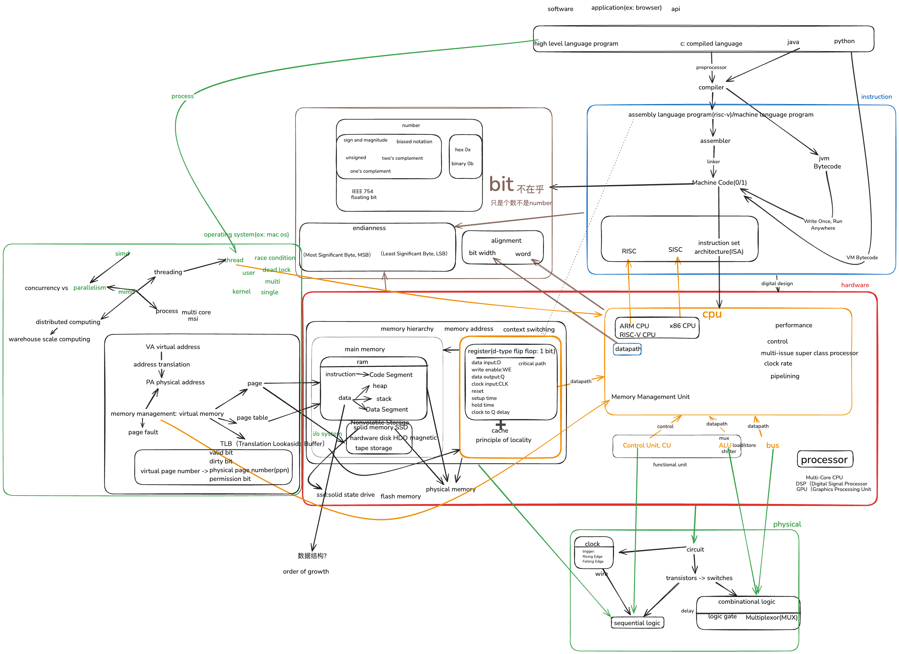
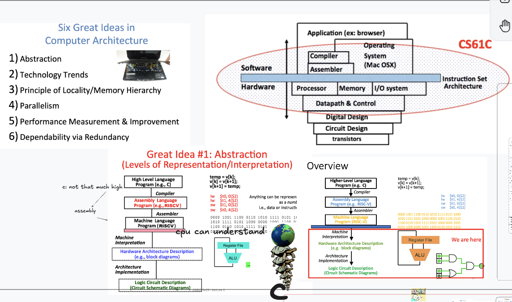

## 🧭 Whole Picture

---

## 📚 Chapter Directory (Aligned with Standard Curriculum)

| No. | Module | Status | Note Link |
|-----|--------|--------|-----------|
| 01  | Bit Basics | ✅ Done | [01_bit](../01_bit) |
| 02  | Float Representation | ✅ Done | [02_float](../02_float) |
| 03  | IEEE 754 | ✅ Done | [03_ieee754](../03_ieee754) |
| 04  | Instruction Set (ISA) | ✅ Done | [04_isa](../04_isa) |
| 05  | Register File | ✅ Done | [05_registers](../05_registers) |
| 06  | Circuits & Switches | ✅ Done | [06_circuits](../06_circuits) |
| 07  | CPU Clock Cycle | ✅ Done | [07_cpu](../07_cpu) |
| 08  | Datapath | ✅ Done | [08_datapath](../08_datapath) |
| 09  | Pipeline | ✅ Done | [09_pipeline](../09_pipeline) |
| 10  | Memory Hierarchy | ✅ Done | [10_memory](../10_memory) |
| 11  | Cache | ✅ Done | [11_cache](../11_cache) |

---

## 🧱 Still Need to Fill

| Module | Description | Priority |
|--------|-------------|----------|
| Control | Microarchitecture control logic, FSM | 🔥🔥🔥🔥 |
| Hazard | Structural/Data/Control Hazards | 🔥🔥🔥 |
| Forwarding | Prediction, Bypass logic | 🔥🔥 |

---

## 🧠 Suggested Learning Path

| Step | Topics | Why |
|------|--------|-----|
| Step 1 | Bit & Float | Build foundational understanding of binary data |
| Step 2 | ISA & Registers | Understand how instructions talk to hardware |
| Step 3 | CPU Clock & Datapath | Dive into the core computing pipeline |
| Step 4 | Pipeline & Memory & Cache | Learn about performance optimization |

---

## 🧠 Ultimate Comparison: Architecture vs OS

| Category | Computer Architecture | Operating System |
|---------|-----------------------|------------------|
| Focus | Logic gates, hardware execution | Process abstraction, resource mgmt |
| Input/Output | ALU, cache, control lines | Process, syscall, kernel I/O |
| Optimization | Clock, pipelining, memory latency | Page fault, interrupt handling |

---

## 🎓 Extra Reference: CS61C Slides

